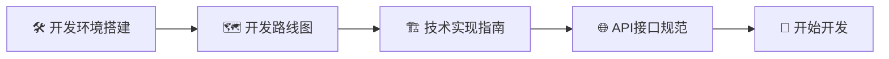
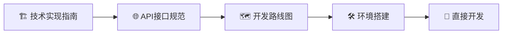
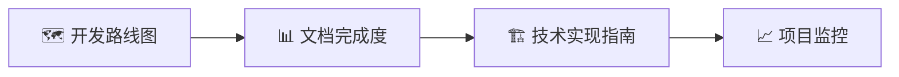
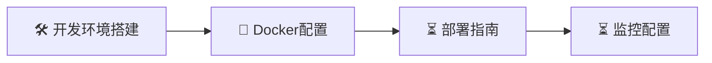

# 📖 MarketPulse 文档导航

欢迎来到 MarketPulse 项目的文档导航页！这里是您探索项目文档的指南针，帮助您快速找到需要的信息和学习资源。

> 💡 **首次访问？** 建议先查看 [开发环境搭建](development/README-DEV.md) 快速启动项目，然后根据您的角色选择相应的学习路径。

## 📁 文档分类

### 🛠️ 开发文档 (`/development/`)
专业的技术开发文档，包含项目架构、API规范、开发指南等。

### 📚 用户指南 (`/guides/`)
面向最终用户的使用指南和教程（规划中）。

### 🤖 AI协作工具 (`/ai-collaboration/`)
专门针对MarketPulse项目的AI协作文档和指南。

| 📄 主要文件 | 📝 描述 |
|------------|---------|
| [🚀 快速上下文指南](ai-collaboration/AI-CONTEXT-GUIDE.md) | 30秒让新AI助手了解项目状态 |
| [📊 项目状态报告](ai-collaboration/PROJECT-STATUS-2025-07-20.md) | 完整的项目进度和技术架构 |
| [💡 使用示例](ai-collaboration/USAGE-EXAMPLES.md) | 实际应用场景 |

### 💬 对话记录 (`../conversations/`)
所有AI对话和项目技术讨论记录，统一管理便于查找。

**AI协作工具资源**:
- [🎯 Prompt库](../prompts/) - 专业化AI助手提示词集合
- [🔧 工具脚本](../scripts/) - 自动化工具
- [📖 工具说明](../README.md) - AI-Protocol-Lab完整使用指南

## 📖 文档导航

## 📖 开发文档导航

### 🚀 新手入门 (推荐起点)
| 📄 文档 | 📝 描述 | ⏱️ 预计时间 | 🎯 适用人群 |
|---------|---------|------------|------------|
| [🛠️ 开发环境搭建](development/README-DEV.md) | 一键启动开发环境，包含详细配置说明 | 10分钟 | 🌟 所有开发者 |

### 📋 项目规划与架构
| 📄 文档 | 📝 描述 | ⏱️ 预计时间 | 🎯 适用人群 |
|---------|---------|------------|------------|
| [🗺️ 开发路线图](development/DEVELOPMENT-ROADMAP.md) | 完整的项目规划、优先级和时间安排 | 15分钟 | 📊 项目管理者、开发者 |
| [🏗️ 技术实现指南](development/TECHNICAL-GUIDE.md) | 系统架构、技术栈和实现方案 | 20分钟 | 🔧 技术人员、架构师 |
| [🌐 API接口规范](development/API-SPECIFICATION.md) | 完整的RESTful API文档和使用说明 | 25分钟 | 🔌 前后端开发者 |

### 🛠️ 开发指南 (规划中)
| 📄 文档 | 📝 描述 | 🚧 状态 |
|---------|---------|---------|
| 🎨 前端组件库 | React组件使用指南和最佳实践 | ⏳ 待编写 |
| ⚙️ 后端服务开发 | Go服务开发规范和代码示例 | ⏳ 待编写 |
| 🗄️ 数据库操作 | MySQL数据操作和优化指南 | ⏳ 待编写 |

### 🚢 部署运维 (规划中)
| 📄 文档 | 📝 描述 | 🚧 状态 |
|---------|---------|---------|
| 🐳 Docker部署 | 容器化部署完整方案 | ⏳ 待编写 |
| 🌐 生产环境配置 | 生产环境最佳实践和安全配置 | ⏳ 待编写 |
| 📊 监控和日志 | 系统监控、日志收集和分析 | ⏳ 待编写 |

### 🧪 质量保证 (规划中)
| 📄 文档 | 📝 描述 | 🚧 状态 |
|---------|---------|---------|
| 🔬 单元测试 | 前后端测试策略和工具使用 | ⏳ 待编写 |
| 🔗 集成测试 | API测试方案和自动化测试 | ⏳ 待编写 |
| ⚡ 性能测试 | 负载测试和性能优化指南 | ⏳ 待编写 |

## 💬 AI对话记录

### 📝 对话记录说明
所有AI对话和项目技术讨论记录统一存储在 `../conversations/` 目录中，按时间顺序排列，便于查找和追踪项目发展历程。

### 📄 命名规范
```
conversations/YYYY-MM-DD_[主题描述].md
```

**示例**:
- `conversations/2025-07-20_项目文档结构优化.md`
- `conversations/2025-07-20_API集成方案讨论.md`
- `conversations/market-pulse-dashboard-upgrade_2025-07-20.md`

### 🔍 查找对话记录
- 📁 **位置**: `../conversations/`
- 📋 **内容**: AI开发对话、技术讨论、决策过程、问题解决方案
- ⏰ **排序**: 按文件名时间顺序排列

## 📊 文档完成度

### ✅ 已完成 (4/9 文档)
| 📄 文档 | 📈 完成度 | 📅 最后更新 | 📝 说明 |
|---------|----------|------------|------|
| 🛠️ 开发环境搭建 | 95% | 2025-01-20 | 包含一键启动和故障排除 |
| 🗺️ 开发路线图 | 90% | 2025-01-20 | 详细的分阶段开发计划 |
| 🏗️ 技术实现指南 | 85% | 2025-01-20 | 完整的架构和技术方案 |
| 🌐 API接口规范 | 80% | 2025-01-20 | 全面的接口设计文档 |

### 🔄 开发进度 (项目层面)
| 🎯 功能模块 | 📈 进度 | 🚧 状态 | 📝 说明 |
|------------|--------|---------|------|
| 🔌 真实API集成 | 80% | ✅ 基本完成 | CoinGecko API完全集成，前端集成中 |
| 🔐 用户认证系统 | 20% | 📋 待开发 | 下一个开发优先级 |
| 🧪 测试覆盖 | 15% | 📋 规划中 | API测试完成，需要更多覆盖 |

### ⏳ 待完成文档 (5/9 文档)
- [ ] 🎨 前端组件开发指南 - React组件库和最佳实践
- [ ] ⚙️ 后端服务开发指南 - Go服务开发规范
- [ ] 🗄️ 数据库设计详解 - MySQL设计和优化
- [ ] 🐳 部署运维指南 - Docker部署和生产配置
- [ ] 🧪 测试策略文档 - 完整的测试体系

## 🎯 学习路径指南

### 🌟 新手开发者路径 (推荐)


**详细步骤**:
1. **🛠️ 环境搭建** (10分钟) - [开发环境搭建](README-DEV.md)
   - 一键启动项目，熟悉开发环境
2. **🗺️ 了解规划** (15分钟) - [开发路线图](DEVELOPMENT-ROADMAP.md)
   - 理解项目目标和开发优先级
3. **🏗️ 学习架构** (20分钟) - [技术实现指南](TECHNICAL-GUIDE.md)
   - 掌握技术栈和系统设计
4. **🌐 熟悉接口** (25分钟) - [API接口规范](API-SPECIFICATION.md)
   - 了解前后端交互方式
5. **🚀 开始实践** - 选择感兴趣的功能开始开发

### 👨‍💻 有经验开发者路径 (快速通道)


**快速上手**:
1. **🏗️ 架构概览** (10分钟) - 快速了解技术栈和设计
2. **🌐 接口文档** (15分钟) - 查看API设计和数据结构
3. **🗺️ 开发计划** (5分钟) - 了解当前优先级和任务
4. **🛠️ 环境启动** (5分钟) - 快速启动开发环境
5. **🚀 选择任务** - 根据技能和兴趣选择开发任务

### 📊 项目管理者路径


**管理视角**:
1. **🗺️ 项目规划** - 了解开发计划和里程碑
2. **📊 进度跟踪** - 查看当前完成度和瓶颈
3. **🏗️ 技术评估** - 理解技术选型和架构决策
4. **📈 风险管控** - 识别技术风险和资源需求

### 🚀 运维人员路径 (部分可用)


**运维准备**:
1. **🛠️ 环境理解** - 了解开发环境配置
2. **🐳 容器化** - 熟悉Docker配置和编排
3. **⏳ 部署方案** - 等待部署指南完成
4. **⏳ 监控体系** - 等待监控配置文档

## 🤝 参与文档建设

我们热烈欢迎社区参与文档建设！您的贡献将帮助更多开发者更好地使用MarketPulse。

### 📝 贡献方式
| 🎯 贡献类型 | 📝 描述 | 🚀 如何开始 |
|------------|---------|------------|
| 🐛 **错误修正** | 修复文档中的错误或过时信息 | 直接提交PR或Issue |
| ✨ **内容补充** | 添加缺失的说明或示例 | 参考写作规范提交PR |
| 🎨 **格式优化** | 改进文档的可读性和格式 | 遵循Markdown规范 |
| 🌍 **翻译贡献** | 提供多语言版本 | 联系维护者讨论 |
| 📖 **新文档** | 编写待完成的文档 | 查看待完成列表选择 |

### 📋 文档写作规范
- **📚 结构清晰**: 使用层次分明的标题结构
- **💡 示例丰富**: 提供具体的代码示例和截图
- **🎯 目标明确**: 明确文档的目标读者和使用场景
- **⏰ 保持更新**: 确保内容与代码同步更新
- **🔗 链接有效**: 检查所有链接的有效性
- **📱 格式统一**: 遵循项目的Markdown格式规范

### 🚀 快速贡献指南
```bash
# 1. Fork项目
git clone https://github.com/your-username/market-pulse.git

# 2. 创建文档分支
git checkout -b docs/improve-readme

# 3. 编辑文档
# 在docs/目录下编辑相应文档

# 4. 提交更改
git add docs/
git commit -m "docs: improve documentation structure"

# 5. 推送并创建PR
git push origin docs/improve-readme
```

## 🆘 获取帮助

### 📞 支持渠道
| 🎯 问题类型 | 📍 最佳渠道 | ⏱️ 响应时间 |
|------------|------------|------------|
| 🐛 **Bug报告** | [GitHub Issues](https://github.com/ape7054/trading-dashboard/issues) | 1-2天 |
| 💬 **功能讨论** | [GitHub Discussions](https://github.com/ape7054/trading-dashboard/discussions) | 1-3天 |
| 📖 **文档问题** | 本文档或相关Issue | 1天内 |
| 🚀 **快速问题** | 项目README或开发指南 | 立即 |

### 🔍 常见问题快速导航
- **❓ 环境启动失败？** → [开发环境搭建](README-DEV.md) 故障排除部分
- **❓ API接口疑问？** → [API接口规范](API-SPECIFICATION.md)
- **❓ 技术架构问题？** → [技术实现指南](TECHNICAL-GUIDE.md)
- **❓ 开发优先级？** → [开发路线图](DEVELOPMENT-ROADMAP.md)
- **❓ 如何贡献代码？** → [项目主页](../README.md) 贡献指南

### 📚 外部资源
- [React官方文档](https://react.dev/) - 前端开发参考
- [Go官方文档](https://golang.org/doc/) - 后端开发参考
- [Material UI文档](https://mui.com/) - UI组件库
- [Docker文档](https://docs.docker.com/) - 容器化部署

---

<div align="center">

**📊 文档统计**: 4个已完成 | 5个规划中 | 总计9个文档

**📅 最后更新**: 2025年7月20日 | **📝 文档版本**: v2.1 | **👥 维护者**: MarketPulse开发团队

**💡 建议或问题？欢迎提交 [Issue](https://github.com/ape7054/trading-dashboard/issues) 或 [Discussion](https://github.com/ape7054/trading-dashboard/discussions)**

---

*📚 让文档成为开发者最好的朋友* 🚀

</div>
