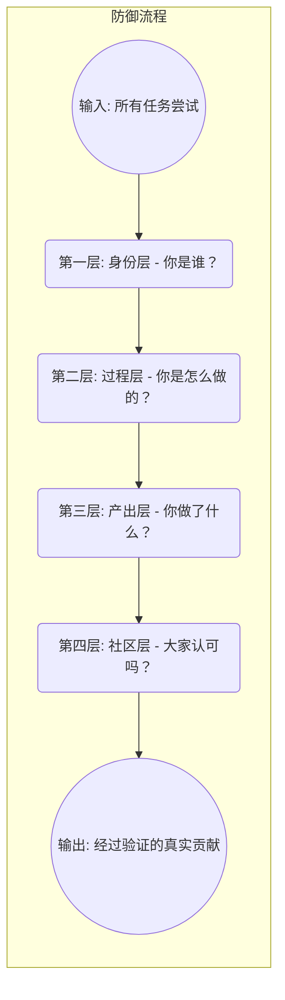

# DAO的免疫系统：一个无法作弊的四层立体防御框架

## 1. 核心理念：让作弊的成本高于诚实

任何防作弊系统的目标，都不是追求技术上的“绝对无法作弊”，而是构建一个经济学和心理学上的博弈模型，使得**作弊的综合成本（金钱、时间、声誉风险）远高于诚实完成任务所带来的回报**。

本框架通过四个相互关联的防御层面，层层过滤，将作弊行为扼杀在不同阶段，从而打造一个高信任度的能力验证环境。

## 2. 可视化模型：信任漏斗

---

## 3. 四层防御详解

### 第一层：身份层 (The "Who") - 确保“一人一号”

*   **目标**：从源头杜绝女巫攻击（一人多号刷分）和身份伪造（代考）。这是信任的入口。

*   **实现机制**：
    *   **[Tier 1 - 基础] 社交账户关联**：要求绑定长期使用的GitHub、Twitter、LinkedIn等账户，作为初步的身份佐证。
    *   **[Tier 2 - 核心] 人性证明 (Proof of Humanity)**：这是关键防线。强制要求用户通过以下至少一种方式验证其唯一真人身份：
        *   **Worldcoin**：通过虹膜扫描验证。
        *   **BrightID / Proof of Humanity**：通过社交验证图谱进行真人认证。
    *   **[Tier 3 - 高级] 动态生物验证**：对于高价值或高风险的任务，在任务开始前，系统会发起一次**实时活体检测 (Liveness Check)**，要求用户完成随机指令（如转头、眨眼），以证明是真人在摄像头前操作。

*   **防御效果**：过滤掉绝大多数的机器人账户、小号和低成本的身份伪造者。

---

### 第二层：过程层 (The "How") - 监控“行为与环境”

*   **目标**：确保是用户本人在独立、合规的环境下完成任务，最大程度地限制外部协助和使用未经授权的工具。

*   **实现机制**：
    *   **[Tier 1 - 基础] 动态挑战 (Dynamic Challenges)**：任务描述中包含随机生成的变量或约束，使任何提前准备的“标准答案”或题库失效。
    *   **[Tier 2 - 核心] 环境约束 (Constrained Environment)**：对于编程类任务，要求在定制的在线IDE中完成，该IDE具备以下功能：
        *   **网络限制**：只允许访问白名单内的官方文档网站。
        *   **剪贴板监控**：限制或记录从外部来源的大段粘贴行为。
        *   **浏览器焦点检测**：高频次地切换到其他无关标签页将被标记为可疑行为。
    *   **[Tier 3 - 高级] 行为分析 (Behavioral Analytics)**：通过AI在后台持续分析用户的行为模式，建立个人基线：
        *   **击键动力学 (Keystroke Dynamics)**：分析打字的速度、节奏、间隔和错误率。任务过程中模式突变是换人的强烈信号。
        *   **编码/写作风格一致性**：将当前任务的风格（变量命名、代码结构、行文措辞）与用户的历史作品进行比对。

*   **防御效果**：让“请外援”和“抄袭现有解决方案”变得极为困难和容易被发现。

---

### 第三层：产出层 (The "What") - 审查“最终作品”

*   **目标**：检测最终提交的作品是否存在抄袭、AI代写等问题，并验证提交者是否真正理解其作品。

*   **实现机制**：
    *   **[Tier 1 - 基础] 自动化检测**：
        *   **代码抄袭检测**：使用`Moss`或`JPlag`等成熟工具，与历史提交和公共代码库（如GitHub）进行比对。
        *   **AI内容检测**：集成最新的AIGC检测模型，对文本和代码进行扫描，给出“AI生成概率”分数。
    *   **[Tier 2 - 核心] 强制过程展示 (Proof of Process)**：要求提交物必须包含完整的创作过程记录，而不仅仅是最终成品。
        *   **代码**：必须提交完整的Git提交历史记录。
        *   **设计**：必须包含草图、废弃稿和迭代过程的Figma历史记录。
    *   **[Tier 3 - 高级] 口头答辩 (The Oral Defense)**：**这是检验真实理解程度的终极杀手锏**。对于所有中高价值的任务，强制要求提交者录制一段1-2分钟的短视频，回答一个关于其作品细节的随机问题。例如：“请解释你为何选择X算法而不是Y算法来实现这个功能？它的时空复杂度如何？”

*   **防御效果**：确保了提交物的原创性，并能精准识别出那些只知其然不知其所以然的“搬运工”。

---

### 第四层：社区层 (The "Consequences") - 引入“社会性与经济性惩罚”

*   **目标**：通过社区共识和经济博弈，让作弊的长期代价变得无法承受，从而形成强大的威慑。

*   **实现机制**：
    *   **[Tier 1 - 基础] 开放的争议期与挑战机制**：所有通过验证的任务都设有7天的“争议期”。社区任何成员若发现作弊证据，均可发起公开挑战。
    *   **[Tier 2 - 核心] 利益绑定的同行验证 (Incentivized Peer Validation)**：
        *   验证者在评审时需要**质押 (Stake)**一定数量的DAO代币。
        *   如果他们批准了一个后被证实为作弊的作品，其质押将被**罚没 (Slash)**，声誉分也会受到重创。这激励验证者成为尽职的“守门人”。
    *   **[Tier 3 - 高级] 声誉的永久性污点**：
        *   一旦作弊行为被社区仲裁机制（如Aragon Court）证实，该用户的**灵魂绑定通证（SBT）上会被附加一个永久的、公开可见的“作弊”标记**。
        *   这相当于在数字身份上留下了不可磨灭的案底，会使其在整个Web3生态系统中信誉破产。

*   **防御效果**：将防作弊从纯粹的技术对抗，升级为社区共治下的社会性与经济性博弈，让作弊者无所遁形且代价惨重。 