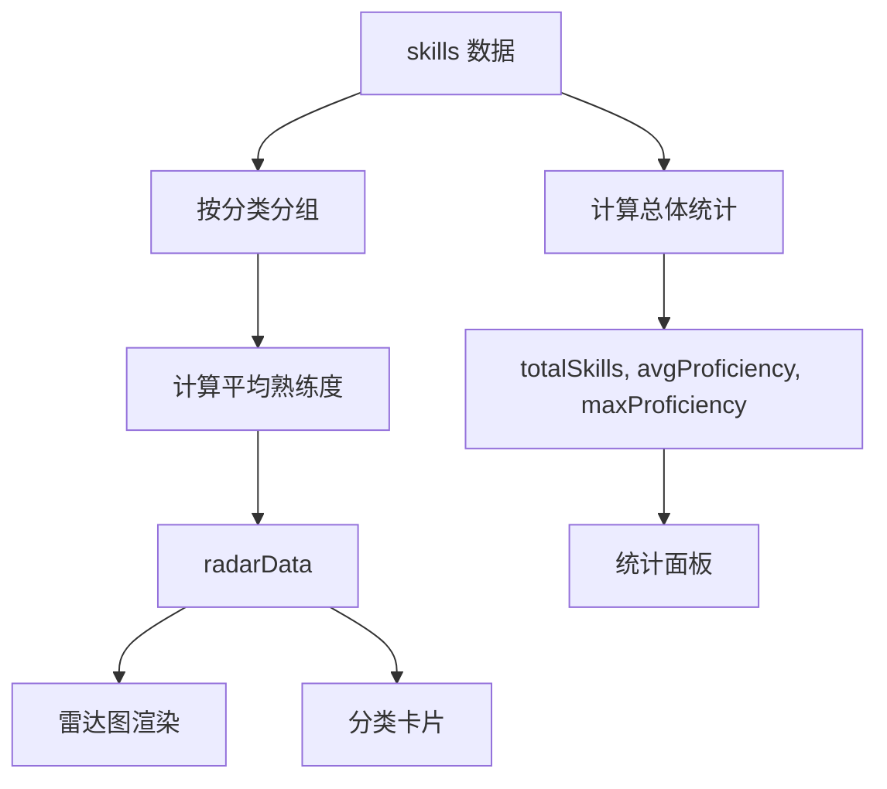

# SkillRadarChart 组件优化总结

## 📊 组件概述

**文件位置：** `src/components/about/SkillRadarChart.tsx`

这是一个综合技能雷达图组件，展示所有技能分类的平均熟练度对比，为用户提供技能概览。

## ✨ 优化内容

### 1. 视觉效果升级

#### 渐变系统
- **径向渐变填充**：从中心到边缘的渐变效果 (80% → 40% → 10% 透明度)
- **线性渐变描边**：从上到下的渐变边框 (100% → 60% 透明度)
- 使用 SVG `<defs>` 定义可复用的渐变

#### 雷达图优化
- 点位尺寸：6px (普通) → 8px (hover)
- 描边宽度：3px
- 网格样式：虚线 (3 3)，30% 透明度
- 刻度显示：5 层同心圆 (0-100)

### 2. 交互增强

#### 专业 Tooltip
```tsx
- 显示分类图标和名称
- 平均熟练度百分比（主色高亮）
- 该分类的技能数量
- 半透明背景 + 模糊效果
- 主色边框高亮
```

#### Cursor 效果
- 虚线光标 (strokeDasharray: "5 5")
- 主题色描边
- 2px 线宽

### 3. 统计信息面板

新增 4 个关键指标卡片：

| 指标 | 说明 |
|------|------|
| 总技能数 | 所有技能总计 |
| 平均熟练度 | 全部技能的平均值 |
| 最高熟练度 | 单项技能的最高值 |
| 技术领域 | 分类数量 |

**样式特点：**
- 主色背景 (5% 透明度)
- 主色边框 (20% 透明度)
- 2xl 字体大小
- 响应式网格布局 (2 列 → 4 列)

### 4. 分类详情列表

展示每个技能分类的：
- 图标
- 分类名称
- 技能数量
- 平均熟练度

**交互效果：**
- Hover 背景高亮
- 渐入动画 (stagger effect)
- 响应式网格 (2 列 → 4 列)

### 5. 动画系统

#### 入场动画
- 主容器：fadeInUp 效果
- 统计面板：延迟 0.3s，向上滑入
- 分类卡片：staggerContainer + listItem 逐个渐入

#### 性能优化
- `viewport={{ once: true }}` - 只播放一次
- 使用 framer-motion 的 viewport margin 优化触发时机

### 6. 响应式设计

#### 图表尺寸
- 最大高度：400px (从 300px 提升)
- 保持方形比例 (aspect-square)
- 容器自适应宽度

#### 网格布局
| 断点 | 统计面板 | 分类列表 |
|------|---------|---------|
| 小屏 | 2 列 | 2 列 |
| 中屏+ | 4 列 | 4 列 |

## 📐 数据流



## 🎨 配色方案

- **主色填充**：`hsl(var(--primary))` + 渐变透明度
- **描边**：线性渐变 (主色)
- **背景**：主色 5% 透明度
- **边框**：主色 20-50% 透明度
- **文字**：foreground / muted-foreground

## 🔧 技术栈

- **Recharts**: RadarChart, PolarGrid, PolarAngleAxis, PolarRadiusAxis, Radar
- **Framer Motion**: fadeInUp, staggerContainer, listItem
- **shadcn/ui**: Card, ChartContainer, ChartTooltip
- **Next-intl**: 国际化支持

## 📊 对比：优化前后

| 特性 | 优化前 | 优化后 |
|------|--------|--------|
| 视觉效果 | 纯色填充 | 渐变填充 + 描边 |
| Tooltip | 基础信息 | 图标 + 详细数据 |
| 数据展示 | 仅雷达图 | 雷达图 + 统计 + 列表 |
| 动画 | 基础淡入 | 多层级动画 |
| 图表尺寸 | 300px | 400px |
| 信息密度 | 低 | 高 |

## 🚀 使用示例

组件在 About 页面中的位置：

```tsx
// src/app/[locale]/about/page.tsx
<section className="py-16 md:py-24 bg-muted/30">
  <div className="container mx-auto px-6 md:px-8 max-w-4xl">
    <SkillRadarChart />
  </div>
</section>
```

## 📝 国际化

使用的翻译 keys：

```json
{
  "skills": {
    "proficiency": "熟练度",
    "radarChart": {
      "title": "技能雷达图",
      "description": "各技术领域综合能力评估"
    },
    "categories": {
      "frontend": "前端开发",
      "backend": "后端开发",
      "blockchain": "区块链",
      "devops": "DevOps"
    }
  }
}
```

## ✅ 验证清单

- [x] Lint 错误已修复
- [x] 渐变效果正常显示
- [x] Tooltip 交互流畅
- [x] 统计数据准确计算
- [x] 动画效果平滑
- [x] 响应式布局正常
- [x] 国际化文本完整
- [x] 性能优化 (viewport once)

## 🎯 后续优化建议

1. **暗色模式优化**：为暗色主题定制渐变色
2. **导出功能**：添加图表导出为图片的功能
3. **对比模式**：支持多个时间段的技能对比
4. **交互式筛选**：点击分类高亮对应区域
5. **数据来源**：添加数据最后更新时间

